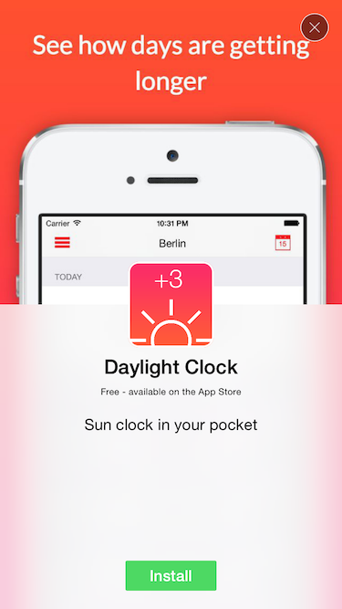
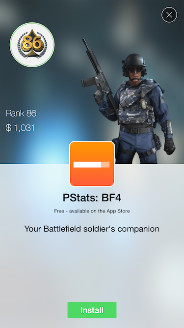

# TAPromotee

[](http://cocoapods.org/pods/AbTrackingLib)


TAPromotee is a pod that allows you to show a cross promotion to a iOS app just by supplying its App Store id. It automatically fetches the info about the app using the iTunes API:

- App name
- App icon
- App price
- Screenshot 

When the user taps the install button, the `SKStoreProductViewController` is presented.


## Requirements

- iOS 7.0+
- iPhone
- Portrait orientation
- The iTunes API references the images via http so you have to disable ATS in your app. In your plist

```
    <key>NSAppTransportSecurity</key>
    <dict>
        <key>NSAllowsArbitraryLoads</key>
        <true/>
    </dict>
```

## Install

TAPromotee is available through [CocoaPods](http://cocoapods.org), to install
it simply add the following line to your Podfile:

```ruby
pod 'TAPromotee'
```

## Usage

To run the example project run `pod try TAPromotee` or clone the repo.

Here's an example of how you should use TAPromotee. 

```objc
#import "TAPromotee.h"
```


```objc
[TAPromotee showFromViewController:self 
                             appId:822702909 
                           caption:@"Sun clock in your pocket" 
                        completion:^(TAPromoteeUserAction userAction) {
    switch (userAction) {
        case TAPromoteeUserActionDidClose:
            // The user just closed the add
            NSLog(@"User did click close");
            break;
        case TAPromoteeUserActionDidInstall:
            // The user did click on the Install button so here you can for example disable the ad for the future
            NSLog(@"User did click install");
            break;
    }
}];
    
```

If you don't want to use the App Store screenshot as background, you can supply a custom background image

```objective-c
[TAPromotee showFromViewController:self
                             appId:937151343
                           caption:@"Your Battlefield soldier's companion"
                   backgroundImage:[UIImage imageNamed:@"sample-app-background"]
                        completion:^(TAPromoteeUserAction userAction) {
    switch (userAction) {
        case TAPromoteeUserActionDidClose:
            // The user just closed the add
            NSLog(@"User did click close");
            break;
        case TAPromoteeUserActionDidInstall:
            // The user did click on the Install button so here you can for example disable the ad for the future
            NSLog(@"User did click install");
            break;
    }
}];
```

## Screens

Here is how it looks like







## Author

Jan Chaloupecky

## License

TAPromotee is available under the MIT license. See the LICENSE file for more info.

## Changelog
See the [release](https://github.com/JanC/TAPromotee/releases) section


